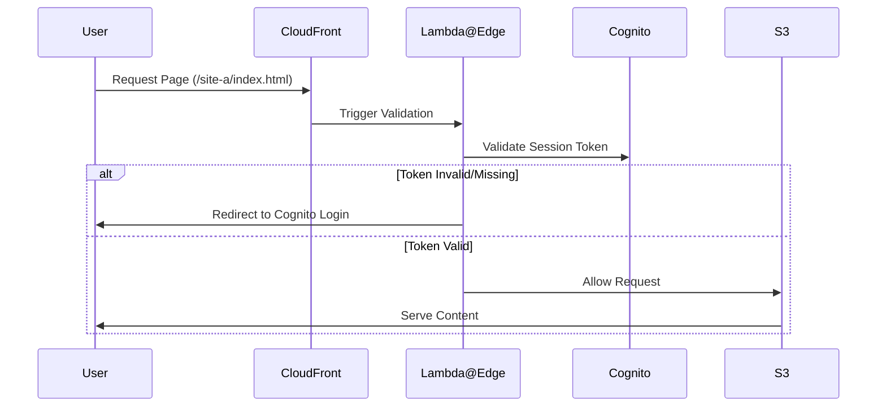

# Authentication Strategy

## Identity Orchestration
To satisfy the requirement for both internal (F5/AD) and external (PingOne) consumers, we employ **Amazon Cognito** as the primary Service Provider (SP). Cognito abstracts the complexity of different protocols, allowing the microsites to rely on a single set of JWT (JSON Web Tokens).

### Identity Provider (IdP) Mapping
1. **Internal Workforce:**
   - **Flow:** Cognito $\rightarrow$ SAML 2.0 $\rightarrow$ F5 APM $\rightarrow$ Active Directory.
   - **Experience:** Seamless SSO. Internal users are redirected to the corporate login page, authenticated via AD, and returned to the microsite with a Cognito session.
2. **External Customers:**
   - **Flow:** Cognito $\rightarrow$ OIDC/SAML $\rightarrow$ PingOne.
   - **Experience:** External users authenticate via PingOne, providing a secure, managed identity layer.

## Preventing Unauthorized Link Sharing
A common vulnerability in static sites is "security by obscurity," where users assume a secret URL is sufficient. To prevent external clients from sharing links:

### Token-Based Gating (The "Guard")
We implement a **Lambda@Edge** or **CloudFront Function** at the "Viewer Request" trigger.

By validating the identity token on every request, the URL itself becomes meaningless without a valid, authenticated session.

## Internal Network Integration
Internal users accessing the site via Direct Connect and Transit Gateway will route to the CloudFront public endpoints. To ensure this is secure and compliant:
- **WAF Integration:** AWS WAF will be applied to CloudFront to restrict access based on corporate IP ranges for internal-only sites.
- **Private Access:** For strictly internal content, CloudFront can be configured with custom headers that the origin (S3) verifies, or routed through internal load balancers if VPC confinement is strictly required for specific high-sensitivity data.
